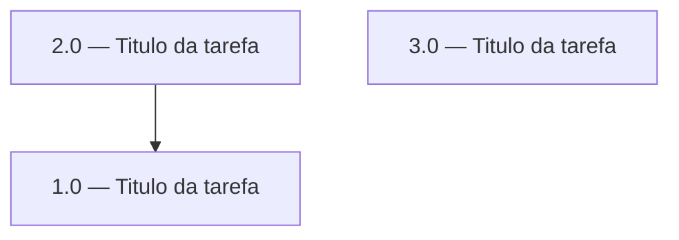

<!-- spec-hash-prd: {{SPEC_HASH_PRD}} -->
<!-- spec-hash-techspec: {{SPEC_HASH_TECHSPEC}} -->

# Resumo das Tarefas de Implementação para [Funcionalidade]

## Metadados
- **PRD:** `tasks/prd-[nome-da-funcionalidade]/prd.md`
- **Especificação Técnica:** `tasks/prd-[nome-da-funcionalidade]/techspec.md`
- **Total de tarefas:** X
- **Tarefas paralelizáveis:** [lista ou "nenhuma"]

## Tarefas

| # | Título | Status | Dependências | Paralelizável |
|---|--------|--------|-------------|---------------|
| 1.0 | [Título da tarefa] | pending | — | — |
| 2.0 | [Título da tarefa] | pending | 1.0 | Não |
| 3.0 | [Título da tarefa] | pending | — | Com 2.0 |

## Dependências Críticas
- [Descrever dependências bloqueantes entre tarefas]

## Riscos de Integração
- [Pontos de integração que podem causar retrabalho]

## Grafo de Dependencias

## Legenda de Status
- `pending`: aguardando execução
- `in_progress`: em execução
- `needs_input`: aguardando informação do usuário
- `blocked`: bloqueado por dependência ou falha externa
- `failed`: falhou após limite de remediação
- `done`: completado e aprovado
